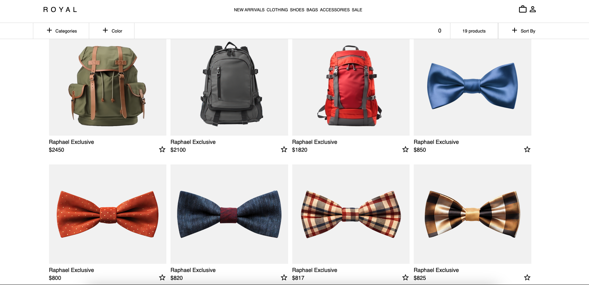

<h1 align='center'>
  Royal - E-Commerce 
</h1>
</img> 
</img> 


<h2>Description</h2>

Royal is an exclusive clothing store app where users can log in with enhanced security through two-factor authentication (2FA). The app offers a personalized shopping experience, allowing users to explore and purchase from a curated selection of fashion based on their style preferences. 

<h2>Features</h2>

<div>
  <ul>
    <li><strong>Modern UI:</strong> The application boasts a visually appealing and intuitive user interface, providing a streamlined browsing and shopping experience.</li>
    <li><strong>Smooth and Easy Checkout:</strong> Add items to your cart with a simple tap, view your selections at a glance, and proceed to a streamlined checkout process, making your shopping experience smooth and enjoyable.</li>
    <li><strong>Never Lose Your Picks:</strong> Items added to your shopping cart remain saved, even if you close the browser or app. Resume your shopping seamlessly at any time, with your selections waiting for you just where you left them.</li>
    <li><strong>Secure Login:</strong> The app ensures robust protection of user data and privacy with two-factor authentication (2FA), offering a secure login process that combines convenience with advanced security measures.</li>
  </ul>
</div>


## Installation
<a id='install'></a>

1. Clone the repo
```
git clone https://github.com/KenMain5/Royal-E-commerce.git
```
2. Install NPM packages
```
npm install
```
3. Run the application
```
npm start
```


# Endpoints
<details>
  <summary>GET /</summary>
  <br>
  <div>
	This is the endpoint that the client request gets when they access the website. The server sends the main page of the website. 
  </div>
  <br>
</details>

<details>
  <summary>POST /register</summary>
  <br>
  <div>
    What happens in the server side, it validates the input received from the client, checks if the email is currently being used, if not, it hashes         the password and stores all the information along with the hashed password by doing a Parametized SQL Query.
  </div>
  <br>
</details>


<details>
  <summary>POST /signin</summary>
  <br>
  <div>
    What happens in the server side, is that it grabs the hashed password that goes along with the username that the client sends, afterwards, we use 
    the BCrypt method to compare the two password hashes. If it is successful, then the user would be logged in. 
  </div>
  <br>
</details>


# Takeaway
This is one of the projects I'm really proud of because it's very fun to do and I learned a lot. 
  
How to deploy a PostGreSQL database(using SupaBase). 
  
Parametized SQL Query (to defend better from Script Attacks)
  
How passwords are supposed to be stored in databases (Salting and Hashing).
  
Had more practice with Asynchronous functions(Async, Await, Catch, Then)
  
One thing I do miss though is working and coding with other people in software projects. 
